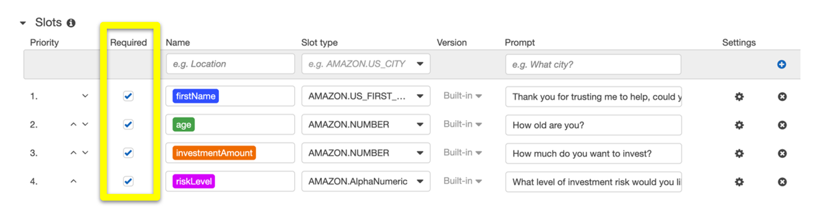
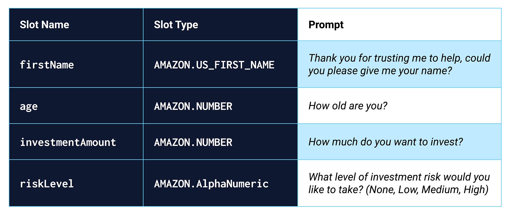

# RetireSmart - RoboAdvisor
### Powered by the Amazons AWS Cloud Services
### For Retirement Plans

### Background

Welcome to the RetireSmart Robo Advisor application! This cutting-edge platform is designed to assist retirement plan providers in expanding their client portfolios, with a particular focus on engaging young individuals. Leveraging the power of machine learning and natural language processing (NLP), our robo advisor offers personalized investment portfolio recommendations for retirement planning, transforming the customer experience.

### Packages Used:

* Amazon Lex [Amazon Lex Bot](https://aws.amazon.com/lex/)
* Lambda [Amazon Lambda](https://aws.amazon.com/lambda/)

### Files

* [lambda_function.py](Starter_Files/lambda_function.py)
* [correct_dialog.txt](Test_Cases/correct_dialog.txt)
* [age_error.txt](Test_Cases/age_error.txt)
* [incorrect_amount_error.txt](Test_Cases/incorrect_amount_error.txt)
* [negative_age_error.txt](Test_Cases/negative_age_error.txt)

---

### Application Description:

In this project, I have developed a powerful Robo Advisor that recommends an investment portfolio for retirement plans. This application combines the capabilities of AWS services and Python programming to provide a seamless and efficient user experience.

The Robo Advisor performs the following tasks:

1. Initial Robo Advisor Configuration:
   - Establishes an Amazon Lex bot with a single intent to initiate a conversation about the user's requirements for retirement investment portfolio suggestions.

2. Build and Test the Robo Advisor:
   - Ensures that the bot functions correctly and provides accurate responses during conversations with the user.
   - The user can interact with the bot through the chatbot window, simulating real-life conversations.

3. Enhance the Robo Advisor with an Amazon Lambda Function:
   - Implements an Amazon Lambda function called `recommend_portfolio()` to validate user input and generate investment portfolio recommendations.
   - The Lambda function performs data validation, such as checking the age and investment amount provided by the user.
   - Based on the selected risk level, the function returns an appropriate investment portfolio recommendation.

The application showcases the seamless integration of AWS services and demonstrates the power of combining machine learning, natural language processing, and cloud computing in the finance domain. It provides users with personalized investment recommendations for their retirement plans, empowering them to make informed financial decisions.

To see the application in action, you can refer to the demo videos or animated GIFs provided, which demonstrate the smooth user interactions and the accurate recommendation generation by the Robo Advisor.

Files to be Uploaded:
To complete the submission, please upload the following files to your repository:

1. Python script containing the final version of the Lambda function.
2. Two short videos or animated GIFs showcasing the Robo Advisor in action, specifically highlighting the interaction with the bot in the "Test bot" pane.

With this application, users can gain valuable insights and recommendations for their retirement investment portfolios, empowering them to make informed financial decisions and plan for a secure future.

### Demonstration / Overview:

#### Step 1: Configuring the Initial Robo Advisor

   

   - The Lex bot is named "RoboAdvisor" and serves as a robo advisor.
   - It is configured for English (US) language and uses the Salli voice for output.
   - The session timeout is set to 5 minutes.
   - Sentiment analysis and COPPA compliance are not enabled.
   - Advanced options are not enabled, using default settings.
   - The bot has an intent called "recommendPortfolio" for providing investment recommendations.
   - Sample utterances capture various user requests related to retirement investment.
   - Four required slots gather necessary information for personalized recommendations.
   - A confirmation prompt message assures the user that their request is acknowledged.
   - The bot is designed to generate the best investment portfolio based on the collected information.

   

In summary, the Lex bot "RoboAdvisor" is created as a robo advisor, configured with language, voice, and timeout settings. It has an intent, sample utterances, and required slots to gather information for personalized recommendations. The confirmation prompt assures the user, and the bot aims to provide the best investment portfolio based on the collected data.

#### Building and Testing the RoboAdvisor

   

In the preceding animation, a user starts a dialogue with the robo advisor. The dialogue is as follows:

   """
   User: I want to invest for my retirement

   Robo advisor: Thank you for trusting me to help, could you please give me your name?

   User: Bob

   Robo advisor: How old are you?

   User: 53

   Robo advisor: How much do you want to invest?
   
   User: 20000

   Robo advisor: What level of investment risk would you like to take? (None, Low, Medium, High)

   User: Low
   
   Robo advisor: Thanks, now I will look for the best investment portfolio for you.
   """

#### Enhancing our Robo Advisor with an Amazon Lambda Function

   

The Lambda function file used to power our Amazon Lex Chatbot can found in the:

   - 'iambda_function.py' file in the Lambda folder of the repository

Lambda is a serverless computing service provided by Amazon Web Services (AWS) that allows you to run code without managing servers. Here's a brief summary of Lambda and its use cases:

   - Lambda Functions: Lambda enables you to execute your code in response to events without provisioning or managing servers. You can write your code in various supported programming languages and configure Lambda to automatically scale based on the incoming workload.

   - Event-Driven Architecture: Lambda functions are commonly used in event-driven architectures, where they respond to events such as changes to data in storage, updates from IoT devices, or incoming API requests. Lambda functions can be triggered by a wide range of event sources within the AWS ecosystem, such as S3, DynamoDB, SNS, or API Gateway.

   - Scalability and Cost Optimization: Lambda automatically scales your code in response to incoming requests. It provisions the required resources to handle the workload and scales them down when the demand decreases. This dynamic scaling allows you to pay only for the actual compute time consumed, resulting in cost optimization.

   - Microservices and Serverless Applications: Lambda functions are often used to build microservices and serverless applications. Each function can handle a specific task or business logic, and they can be orchestrated together to create complex workflows. This approach simplifies development, deployment, and maintenance, as you can focus on individual functions without worrying about the infrastructure.

   - Real-time File Processing: Lambda is suitable for real-time file processing tasks. For example, you can trigger a Lambda function when a file is uploaded to an S3 bucket, and the function can process the file immediately, perform transformations, extract data, or trigger further actions.

   - Chatbots and Voice Assistants: Lambda can be used in combination with conversational interfaces like Lex or Alexa Skills Kit. It allows you to handle user inputs, perform backend logic, retrieve data from databases or APIs, and generate responses dynamically.

   - Data Transformation and ETL: Lambda is often utilized for data transformation and extract, transform, load (ETL) processes. You can write code to transform data as it is ingested, clean up or validate input, and store the transformed data in the desired format or location.

In summary, Lambda provides a serverless computing environment where you can run code without managing servers. It is commonly used in event-driven architectures, microservices, real-time file processing, chatbots, data transformation, and other scenarios that benefit from scalable, cost-effective, and event-triggered execution.

## Contributors

The sole contributor for this project is:

**NAJIB ABOU NASR**
 no instagram or linkedin yet!
---

## License

Using the 'MIT' license!
--- 

